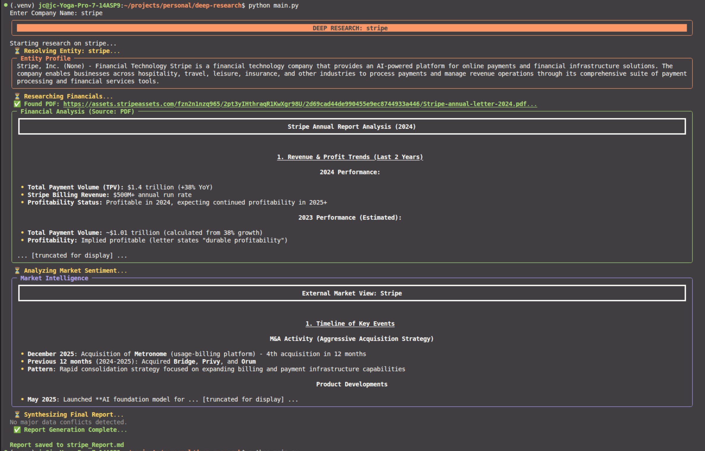
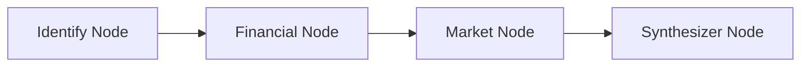

# Deep Research Agent (PoC)

**An autonomous investment analyst that synthesizes financial filings (PDFs) with market intelligence (Web Search) to detect conflicts between management narratives and market reality.**



## 🎯 Objective
To build a Proof of Concept (PoC) agent capable of performing deep due diligence on any company—Public or Private—by autonomously:
1.  **Resolving Entities:** Distinguishing between similarly named entities (e.g., "Peloton Interactive" vs. "Peloton Minerals").
2.  **Waterfall Retrieval:** Prioritizing primary sources (10-Ks/Annual Letters) and falling back to web search only when necessary.
3.  **Conflict Detection:** Explicitly analyzing discrepancies between *Internal Financial Reporting* (what the CEO says) and *External Market Sentiment* (what employees/customers say).

---

## 🏗️ Architecture

The system is built on **LangGraph** to manage state and data flow.



### 1. Identify Node (Entity Resolution)
- **Goal:** Resolve ambiguity.
- **Logic:** Uses an LLM to extract the official `Legal Name`, `Ticker`, and `Sector`.
- **Why:** Prevents searching for "Apple" and getting the "Virginia Agricultural Apple Board."

### 2. Financial Node (Waterfall Logic)
- **Strategy A (Primary):** Search for and download the official PDF Annual Report/10-K based on the resolved Sector/Ticker.
- **Strategy B (Fallback):** If the PDF is missing (Private Co) or parse fails, switch to targeted web scraping for revenue/debt metrics.

### 3. Market Node (Context & Competition)
- Aggregates news, reddit sentiment, and employee reviews (Glassdoor/Blind via search).
- **New Feature:** Performs a specific search for the "Top 3 Competitors" to satisfy market context requirements.

### 4. Synthesizer Node (The "Brain")
- Compiles all data into a structured report.
- **Key Feature:** Runs a "Conflict Analysis" routine to highlight where financials disagree with reality (e.g., "Revenue is up, but Product Quality sentiment is collapsing").

---

## 📂 Highlighted Sample Reports

To validate the agent's capabilities for **Lending & Credit Risk Analysis**, four distinct companies were selected. Each represents a specific "archetype" of risk to stress-test the agent's logic:

| Company | Archetype | Why it was selected | Key Agent Behavior Verified |
| :--- | :--- | :--- | :--- |
| **Salesforce** (CRM) | **The Standard / SaaS** | High-quality public data with standard SaaS metrics. Serves as the "Control Group" to verify table extraction accuracy. | **Precision:** Successfully extracted detailed Income/Balance Sheet tables and calculated margins without hallucination. |
| **Boeing** (BA) | **Industrial Distress** | Capital-intensive balance sheet with massive debt and safety crises. Tests the agent's ability to spot insolvency. | **Risk Detection:** Identified **Negative Equity ($3.3B)** and "Technical Insolvency" despite a 26% revenue increase. |
| **Stripe** (Private) | **Information Gap** | Private company with NO public 10-K. Tests the agent's fallback logic and honesty. | **Safety:** Correctly reported "Data Unavailable" for financials rather than hallucinating numbers. Flagged opacity as a risk. |
| **Spotify** (SPOT) | **Social vs. Financial** | Strong recent financials clashing with severe stakeholder (artist/regulatory) backlash. | **Synthesis:** Successfully contrasted improving margins against the "existential threat" of losing social license to operate. |

---

## 🧬 Evolution & Lessons Learned
This PoC evolved rapidly through "Failure-Driven Development." Here are the critical bugs encountered and the fixes applied:

### Failure 1: The "Apple Board" Incident
*   **The Bug:** Searching for "Apple Annual Report" returned the *Virginia Agricultural Apple Board* PDF.
*   **The Fix:** Implemented **Sector Extraction** in the `Identify` node. The search query is now context-aware: `"{Company} {Sector} Annual Report"`.

### Failure 2: The "Peloton Mining" Incident
*   **The Bug:** Searching for "Peloton" retrieved financial statements for *Peloton Minerals Corp* (a penny stock mining company).
*   **The Fix:** Added strict Entity Resolution. The agent now creates a profile (e.g., "Fitness Technology") and injects that into the financial search query to filter out homonyms.

---

## ⚠️ PoC Limitations & "Dark Patterns"
**Read this before deploying to production.**
To keep the PoC velocity and flavor, several "Anti-Patterns" were used that must be refactored for a production system.

### 1. Naive PDF Parsing (The "Slice" Method)
*   **Current State:** The agent downloads a PDF and blindly slices the first 5 pages + keyword matches.
*   **Production Risk:** This is fragile. It breaks on dual-column layouts or image-heavy 10-Ks.
*   **The Fix:** Implement **Docling** to parse PDFs into a semantic DOM (JSON/XML) to deterministically extract tables.

### 2. Linear Graph Architecture
*   **Current State:** `Identify -> Financials -> Market`.
*   **Production Risk:** If the agent grabs the wrong PDF, it continues processing garbage data until the end.
*   **The Fix:** Implement a **Cyclic Graph** with "Human-in-the-loop" verification, where confidence is low. The agent pauses and ask the user to confirm the entity.

### 3. Context Window Stuffing
*   **Current State:** Dumping raw text into the prompt with a hard character limit.
*   **Production Risk:** High token costs and "Lost in the Middle" phenomenon.
*   **The Fix:** Implement structured extraction to only feed relevant sections (e.g., "Item 8: Financial Statements") to the LLM.

---

## 🚀 Setup & Run

1.  **Install Dependencies:**
    ```bash
    pip install -r requirements.txt
    ```

2.  **Set Environment Variables:**
    Create a `.env` file:
    ```bash
    ANTHROPIC_API_KEY=sk-...
    TAVILY_API_KEY=tv-...
    ```

3.  **Run:**
    ```bash
    python main.py
    ```